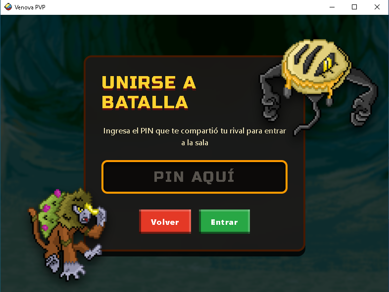

# Venova PVP Battle Client

<p align="center">
    
</p>

Aplicación de escritorio (Electron) para batallas PVP, compatible con **Venova Adventures**. 

Pensado para ser compatible con **Venova Adventure Reforged** que se encuentra en etapa de desarrollo.

<p align="center">
    
</p>

## Tabla de contenidos

- [Características](#características)
- [Tecnologías](#tecnologías)
- [Estructura del proyecto](#estructura-del-proyecto)
- [Requisitos previos](#requisitos-previos)
- [Instalación](#instalación)
- [Uso en desarrollo](#uso-en-desarrollo)
- [Build de producción](#build-de-producción)
- [Licencia](#licencia)

## Características

- Ofrece una interfaz de combates diseñada para trabajar con el motor de Pokemon Showdown y un Mod que incluye los Venomon del juego.

<p align="center">
    
</p>

- Lee los archivos del juego Venova Adventures para importar el equipo usado en el modo historia de partida principal.

<p align="center">
    
</p>

- Genera un código que puede ser compartido con amigos para combatir con ellos en tiempo real.

<p align="center">
    
</p>

- Incluye un modo de batalla de prueba contra el CPU.
- Permite desactivar animaciones de batalla si el usuario lo desea.
- Permite personalizar la interfaz mediante una selección de Temas.

<p align="center">
    
</p>

## Tecnologías

- [Electron](https://www.electronjs.org/) — shell de escritorio
- [Vite](https://vitejs.dev/) — bundler del renderer
- Node.js
- [electron-builder](https://www.electron.build/) — empaquetado de la app
- nodemon + concurrently — hot-reload en desarrollo

## Estructura del proyecto

```
├── src/
│   ├── main/              # Proceso principal de Electron
│   │   ├── main.js
│   │   ├── preload.js
│   │   ├── parseProtocol.js
│   │   ├── parseGameData.js
│   │   ├── loadDictionaries.js
│   │   └── utility.js
│   └── renderer/          # Interfaz (Vite)
│       ├── assets/
│       ├── components/
│       ├── pages/
│       ├── context/
│       ├── styles/
│       ├── hooks/
│       ├── lib/
│       ├── public/
│       ├── main.jsx
│       └── app.jsx
├── data/                   # Datos estáticos del juego (diccionarios, etc.)
├── vite.config.js
├── package.json
└── LICENSE
```

## Requisitos previos

- Node.js versión 24.16.0 o superior
- npm

## Instalación

```bash
git clone https://github.com/WilmerCP/Venova-pvp-battle-client.git
cd Venova-pvp-battle-client
npm install
```

## Uso en desarrollo

```bash
npm run dev
```

Esto levanta el servidor de Vite para el renderer y abre la ventana de Electron con recarga automática al modificar archivos en `src/main`.

## Build de producción

```bash
npm run build
```

Genera el renderer con Vite y empaqueta la app en `release/`.

### Windows y Linux con Docker

Requiere Docker Engine con Compose o Docker Desktop en modo contenedores Linux.
Desde la raíz del repositorio:

```bash
bash docker/build.sh
```

Los archivos quedan en `release/`:

- Windows x86 (32 bits) y x64: instaladores `*-setup.exe` y ejecutables `*-portable.exe`.
- Linux x64: `.AppImage` y `.deb`.

Para compilar solamente una plataforma:

```bash
bash docker/build.sh windows
bash docker/build.sh linux
```

El script actualiza la imagen antes de empaquetar. Las dependencias se
instalan con `npm ci` dentro de la imagen; no necesitas Node.js en el host.
El empaquetado desactiva la recompilación nativa y excluye los módulos SQLite
opcionales del servidor Showdown: este cliente usa su API JavaScript de simulación
y validación. Si se agregan dependencias nativas de escritorio, hay que revisar
esta configuración y proporcionar binarios para cada plataforma.
Compose conserva las descargas de Electron y electron-builder en volúmenes.
La imagen usa `linux/amd64`; en hosts ARM requiere emulación y puede ser lenta.
En Linux los archivos de salida pueden pertenecer a root; puedes recuperar su
propiedad con `sudo chown -R "$(id -u):$(id -g)" release`.

### macOS y builds de todas las plataformas

El flujo usa un host macOS para producir DMG/ZIP de Intel x64 y Apple Silicon arm64.
Los contenedores Linux de Docker no proporcionan las herramientas de empaquetado
y firma de macOS. En un Mac con Node.js 24.21.0:

```bash
npm ci
CSC_IDENTITY_AUTO_DISCOVERY=false npm run build:mac
```

Para generar todas las plataformas, ejecuta **Actions → Build & Release → Run
workflow** en GitHub. El workflow usa Docker para Windows/Linux y un runner macOS
para DMG/ZIP. Descarga los resultados desde los artefactos de la ejecución.
Los tags `v*` también ejecutan el flujo y publican los archivos en GitHub Releases.
Los builds indicados no están firmados ni notarizados; para distribución firmada
se deben configurar los certificados correspondientes.

### Servidor

Todos los paquetes usan por defecto `https://venova-legends.adventurex.games`,
configurado en `src/main/main.js`. No hace falta configurar el servidor al compilar.
`VENOVA_SERVER_URL` permite cambiarlo **al ejecutar la aplicación** para pruebas;
una variable definida solamente durante el build no cambia el valor empaquetado.

## Créditos y links

- Basado en los juegos de la franquicia de Pokemon.
- Spritesheets de [Pokemon Essentials](https://eeveeexpo.com/essentials/news/).
- Spritesheets de [Craftpix](https://craftpix.net/).
- Motor de combates [Pokemon Showdown](https://github.com/smogon/pokemon-showdown).
- Sprites del juego original [Venova Adventures](https://www.instagram.com/venovaregion/).
- Comunidad de [Venova Adventures](https://www.facebook.com/groups/PokemonVenova/).
- [Iconos de tipos pokemon](https://github.com/duiker101/pokemon-type-svg-icons).

## Licencia

Este repositorio está licenciado bajo MIT (ver [LICENSE](./LICENSE)).

> Los assets de terceros (sprites, imágenes, audio, fuentes, etc.) **no** están cubiertos por la licencia MIT y siguen siendo propiedad de sus respectivos titulares de derechos.


<p align="center">
    
</p>
