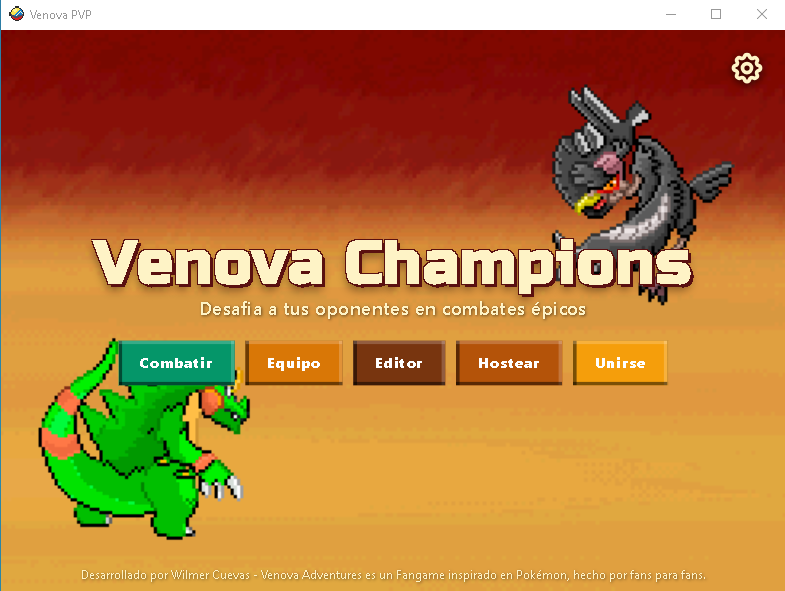
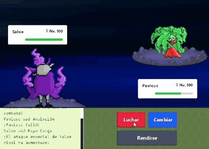
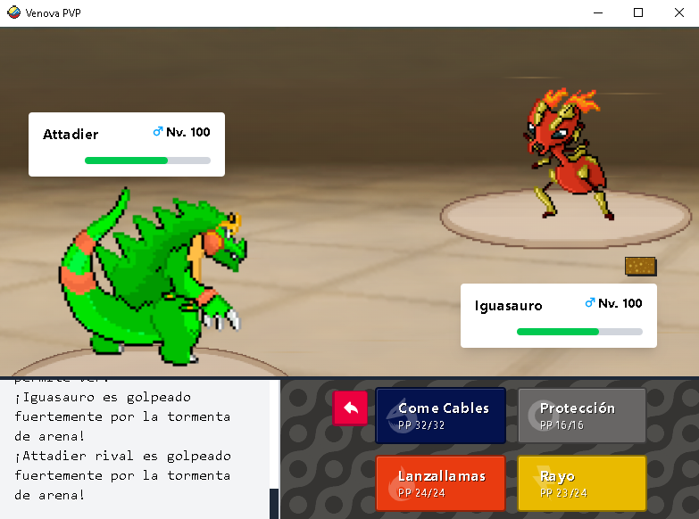
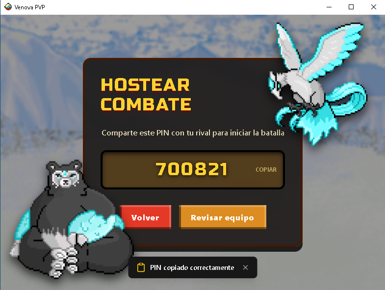
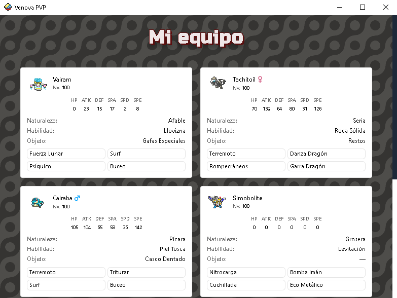
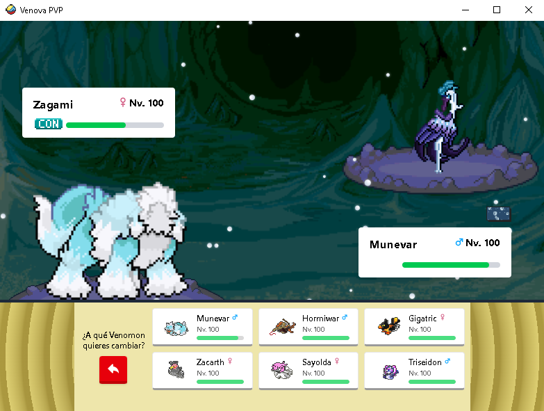

# Venova PVP Battle Client

Aplicación de escritorio (Electron) para batallas PVP, compatible con **Venova Adventures**. 

Pensado para ser compatible con **Venova Adventure Reforged** que se encuentra en etapa de desarrollo.

<p align="center">
    
    
    
</p>

## Tabla de contenidos

- [Características](#características)
- [Tecnologías](#tecnologías)
- [Estructura del proyecto](#estructura-del-proyecto)
- [Requisitos previos](#requisitos-previos)
- [Instalación](#instalación)
- [Uso en desarrollo](#uso-en-desarrollo)
- [Build de producción](#build-de-producción)
- [Licencia](#licencia)

## Características

- Ofrece una interfaz de combates diseñada para trabajar con el motor de Pokemon Showdown y un Mod que incluye los Venomon del juego.
- Lee los archivos del juego Venova Adventures para importar el equipo usado en el modo historia de partida principal.
- Genera un código que puede ser compartido con amigos para combatir con ellos en tiempo real.
- Incluye un modo de batalla de prueba contra el CPU.
- Permite desactivar animaciones de batalla si el usuario lo desea.
- Permite personalizar la interfaz mediante una selección de Temas.

<p align="center">
    
    
    
</p>

## Tecnologías

- [Electron](https://www.electronjs.org/) — shell de escritorio
- [Vite](https://vitejs.dev/) — bundler del renderer
- Node.js
- [electron-builder](https://www.electron.build/) — empaquetado de la app
- nodemon + concurrently — hot-reload en desarrollo

## Estructura del proyecto

```
├── src/
│   ├── main/              # Proceso principal de Electron
│   │   ├── main.js
│   │   ├── preload.js
│   │   ├── parseProtocol.js
│   │   ├── parseGameData.js
│   │   ├── loadDictionaries.js
│   │   └── utility.js
│   └── renderer/          # Interfaz (Vite)
│       ├── assets/
│       ├── components/
│       ├── pages/
│       ├── context/
│       ├── styles/
│       ├── hooks/
│       ├── lib/
│       ├── public/
│       ├── main.jsx
│       └── app.jsx
├── data/                   # Datos estáticos del juego (diccionarios, etc.)
├── vite.config.js
├── package.json
└── LICENSE
```

## Requisitos previos

- Node.js versión 24.16.0 o superior
- npm

## Instalación

```bash
git clone https://github.com/WilmerCP/Venova-pvp-battle-client.git
cd Venova-pvp-battle-client
npm install
```

## Uso en desarrollo

```bash
npm run dev
```

Esto levanta el servidor de Vite para el renderer y abre la ventana de Electron con recarga automática al modificar archivos en `src/main`.

## Build de producción

```bash
npm run build
```

Genera el build del renderer con Vite y empaqueta la app con electron-builder. El ejecutable final queda en [carpeta de salida, ej. `dist/` o `release/`].

## Licencia

Este repositorio está licenciado bajo MIT (ver [LICENSE](./LICENSE)).

> Los assets de terceros (sprites, imágenes, audio, fuentes, etc.) **no** están cubiertos por la licencia MIT y siguen siendo propiedad de sus respectivos titulares de derechos.